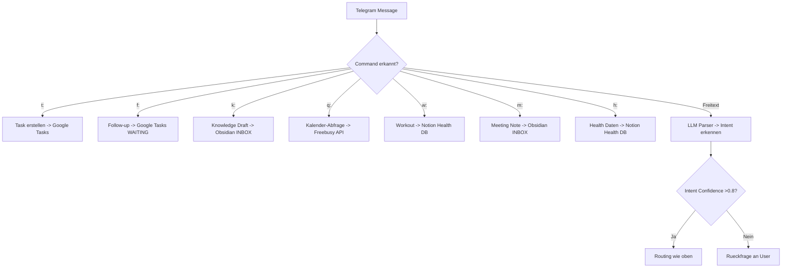

---
tags:
  - telegram
  - commands
  - dsl
---

# Telegram Command DSL — Referenz

## Uebersicht

Eingaben folgen einem kompakten Command-Format. Freitext ist erlaubt, aber das DSL ist Standard.

> [!tip] Prioritaet: Rules > LLM
> LLM wird nur fuer Parsing/Summarization/Classification genutzt, nicht als Wahrheitsquelle.

## Commands

### `t:` — Task erstellen

```
t: Titel /due=YYYY-MM-DD /p=P1 /prio=H /ctx=deepwork
```

| Parameter | Pflicht | Beschreibung | Beispiel |
|-----------|---------|-------------|---------|
| Titel | Ja | Task-Beschreibung | `Notion API einrichten` |
| `/due=` | Nein | Faelligkeitsdatum | `/due=2026-04-01` |
| `/p=` | Nein | Projekt-ID | `/p=P1` |
| `/prio=` | Nein | Prioritaet (H/M/L) | `/prio=H` |
| `/ctx=` | Nein | Kontext | `/ctx=deepwork` |

**Ziel:** Google Tasks (Liste NEXT)

---

### `f:` — Follow-up erstellen

```
f: Follow-up Titel /to=Person /due=YYYY-MM-DD
```

| Parameter | Pflicht | Beschreibung |
|-----------|---------|-------------|
| Titel | Ja | Worum geht's |
| `/to=` | Nein | Person oder E-Mail-Thread |
| `/due=` | Nein | Frist |

**Ziel:** Google Tasks (Liste WAITING)

---

### `k:` — Knowledge/Wissen speichern

```
k: Titel /topic=Thema /src=link|mail|meeting /project=P1
```

| Parameter | Pflicht | Beschreibung |
|-----------|---------|-------------|
| Titel | Ja | Wissens-Titel |
| `/topic=` | Nein | Themenbereich |
| `/src=` | Nein | Quelle (Link, Mail, Meeting) |
| `/project=` | Nein | Projekt-ID |

**Ziel:** Obsidian 00_INBOX (Draft, benoetigt Review)

---

### `q:` — Kalenderabfrage

```
q: free YYYY-MM-DD /window=09:00-17:00 /tz=Europe/Berlin
```

**Ziel:** Google Calendar Freebusy API -> Antwort via Telegram

---

### `w:` — Workout/Training loggen

```
w: workout run 45m rpe=7 /tags=intervals /source=manual
```

| Parameter | Pflicht | Beschreibung |
|-----------|---------|-------------|
| Sportart | Ja | run, gym, swim, bike, etc. |
| Dauer | Ja | z.B. 45m, 1h |
| `rpe=` | Nein | Rate of Perceived Exertion (1-10) |
| `/tags=` | Nein | Tags |
| `/source=` | Nein | manual oder auto |

**Ziel:** Notion Health DB

---

### `m:` — Meeting Note

```
m: Meeting Titel /event=calendar /actions=auto
```

**Ziel:** Obsidian 00_INBOX (Meeting Note Template)

---

### `h:` — Health-Daten

```
h: sleep /note=schlecht geschlafen
h: weigh=82.3
h: nutrition kcal=2100 protein=140
```

**Ziel:** Notion Health DB

## Verarbeitungslogik


